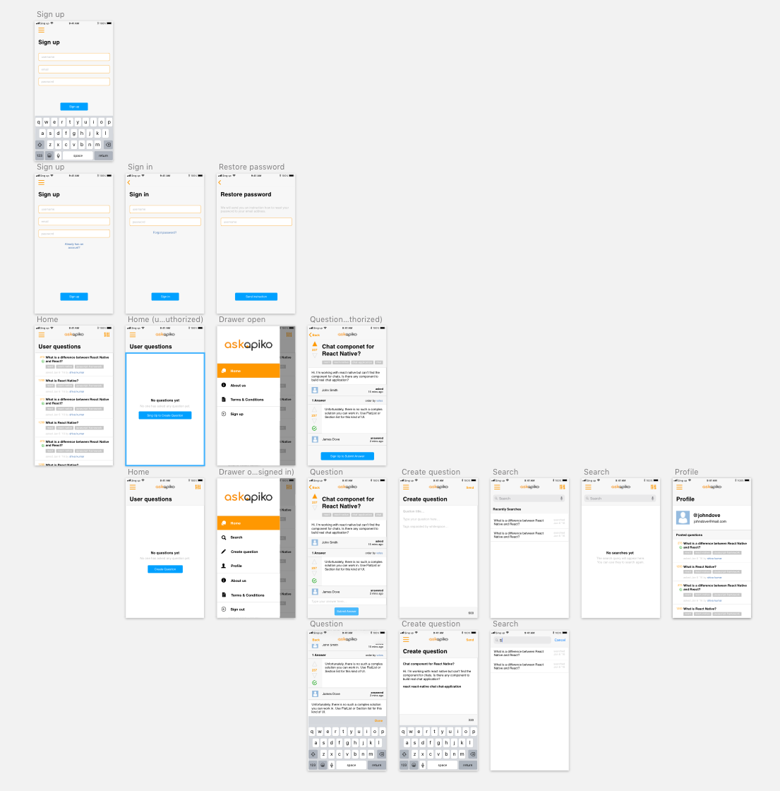

# AskApikoMobile

> Apiko Full Stack Courses 2018 — React Native course demo application

### Assets
- [Design (sketch)](design/AskApikoMobile.sketch)
- [Design (pdf)](design/AskApikoMobile.pdf)

### Links
- [Telegram Channel](https://t.me/TernopilJS)
- [Telegram Chat](https://t.me/joinchat/DSZpeUK5B4G8Ol4cc8_3eQ)
- [Facebook](https://www.facebook.com/TernopilJS/)
- [YouTube](https://www.youtube.com/c/ternopiljs)
- [Apiko Full Stack Courses 2018](https://www.youtube.com/watch?v=EuaRppDfbwA&index=0&list=PLov7F_02Cb0SB9MGWGvR7EQ22tiM_XJS9).

### Preview

## License
All the code available under the MIT + Apache 2.0. licenses. See [LICENSE](LICENSE).
